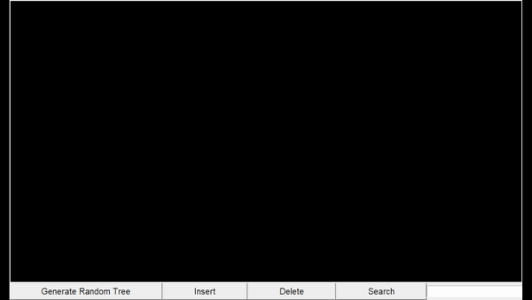
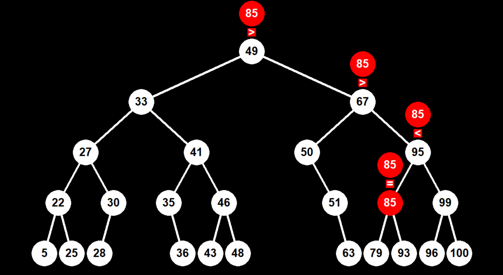

# Binary Search Tree Visualizer

A BST visualizer coded in Python using Tkinter. Made in order to learn Python. Program is useful for people to better understand how a BST works.

|                                                                 |
|:---------------------------------------------------------------:|
|**DELETE NODE ANIMATION**                                        |
|          |
|**SEARCH FOR NODE**                                              |
|              |

## Features
- Generate random trees
- Insert new nodes
- Search for nodes
- Delete nodes

## References

  - [Online BST visualizer](http://btv.melezinek.cz/binary-search-tree.html)
  - [interviewbit tutorial](https://www.interviewbit.com/blog/delete-node-from-binary-search-tree/)